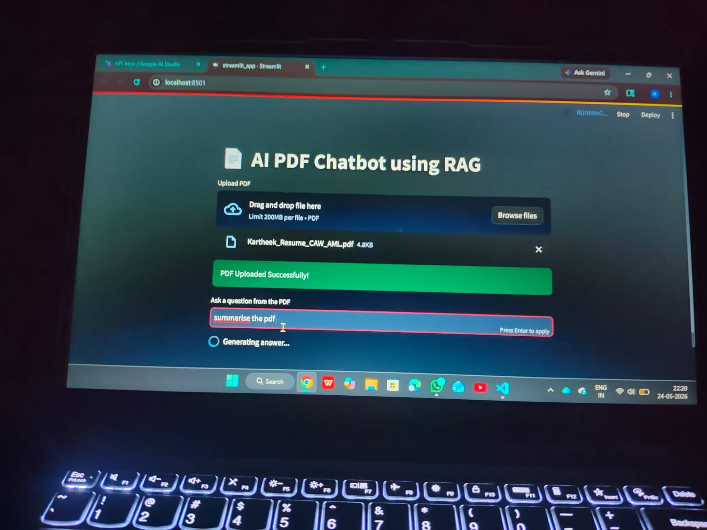

# 📄 AI PDF Chatbot using RAG

An AI-powered PDF chatbot built using Streamlit, LangChain, FAISS, and Google Gemini API.

This application allows users to upload PDF files and ask questions based on the uploaded document content using Retrieval-Augmented Generation (RAG).

---

## 🚀 Features

- Upload PDF files
- Ask questions from PDFs
- AI-generated context-based answers
- Semantic search using FAISS
- Streamlit interactive UI

---

## 🛠️ Tech Stack

- Python
- Streamlit
- LangChain
- FAISS
- Google Gemini API
- PyPDF2

---

## 📂 Project Structure

```bash
ai-pdf-chatbot-rag/
│
├── streamlit_app.py
├── requirements.txt
├── .gitignore
├── README.md
└── chatbot-ui.jpeg
```

---

## 📸 Project UI



---

## ⚙️ Installation

### Clone Repository

```bash
git clone https://github.com/kartheek-r/ai-pdf-chatbot-rag.git
```

### Move into Project Folder

```bash
cd ai-pdf-chatbot-rag
```

### Create Virtual Environment

```bash
python -m venv venv
```

### Activate Virtual Environment

#### Windows

```bash
venv\Scripts\activate
```

#### Mac/Linux

```bash
source venv/bin/activate
```

### Install Dependencies

```bash
pip install -r requirements.txt
```

---

## ▶️ Run Application

```bash
streamlit run streamlit_app.py
```

---

## 👨‍💻 Author

Karthik R
